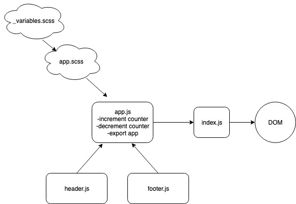

#  LAB

## lab-26-component-base-ui

### Author: Bonnie Wang

### Links and Resources

- [submission PR](https://github.com/jcbwang/lab-26-component-based-ui)
- [code sandbox](https://1xn0t.codesandbox.io/this.handleIncrementButtonClick/)

#### Documentation

- [styleguide](http://xyz.com) (React assignments)

### Modules

#### `app.js` -> handles button clicks and exports App

#### `index.js` -> diffing app elements to dom

#### `footer.js`

####`header.js`

#### Running the app

- `npm run start`

#### UML

